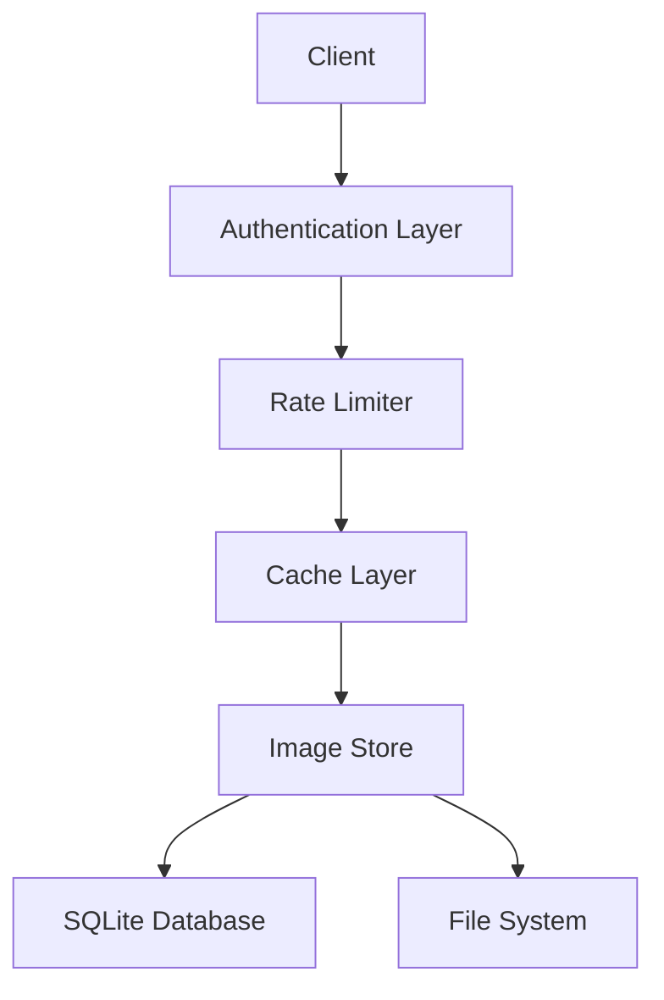

<div align="center">

# Waifu
**High-Performance Image Management API**

[](LICENSE)
[](https://www.rust-lang.org/)

</div>

## Overview

Waifu API is a blazing-fast (mandatory Rust project buzzword) image management system written in Rust, designed for high-throughput image serving with advanced filtering capabilities. It provides enterprise-grade features including authentication, rate limiting, and caching, while maintaining low latency and high reliability.

> [!NOTE]  
> Waifu is still in beta phase, and may not be fully stable.


## Architecture

<div align="center">



</div>

## Key Features

### High Performance
- In-memory caching with configurable TTL
- Asynchronous request handling
- Efficient SQLite database operations
- Batch processing support

### Security
- API key authentication
- Role-based access control
- Configurable rate limiting
- Request tracking and logging

### Image Management
- Local and remote image ingestion
- Metadata extraction and indexing
- Tag-based organization
- Advanced filtering capabilities

## Quick Start

### Prerequisites
- Rust (stable)
- SQLite 3
- 2GB+ available storage

### Installation

```bash
# Clone the repository
git clone https://github.com/AlpinDale/waifu.git
cd waifu

# Build the project
cargo build --release

# Run the server
cargo run --release
```

### Basic Usage

For a more comprehensive documentation, see [docs/api_reference.md](docs/api_reference.md).

```bash
# Add an image
curl -X POST http://localhost:8000/image \
  -H "Authorization: Bearer your_api_key" \
  -H "Content-Type: application/json" \
  -d '{
    "path": "path/to/image.jpg",
    "type": "local",
    "tags": ["example", "test"]
  }'

# Get a random image
curl http://localhost:8000/random \
  -H "Authorization: Bearer your_api_key"
```

## Configuration

| Parameter | Environment Variable | Default | Description |
|-----------|---------------------|---------|-------------|
| Host | `HOST` | 127.0.0.1 | Server host address |
| Port | `PORT` | 8000 | Server port |
| Images Path | `IMAGES_PATH` | /images | Image storage location |
| Rate Limit | `RATE_LIMIT_REQUESTS` | 2 | Requests per second |
| Cache Size | `CACHE_SIZE` | 100 | Maximum cached items |
| Admin Key | `ADMIN_KEY` | Required | Administrator API key |

## Performance

### Memory Usage
- Cache: ~100MB with default settings
- Database: Scales with metadata size
- Image storage: Determined by image count and size

### Throughput
TODO.


## Contributing

We welcome contributions! Please fork the repository and submit a pull request if you have any ideas or suggestions.

## Citation

If you use this software in your research, please cite:

```bibtex
@software{waifu_api_2024,
  author = {Your Name},
  title = {Waifu: High-Performance Image Management System},
  year = {2025},
  url = {https://github.com/AlpinDale/waifu}
}
```

## Acknowledgments

Built with:
- [Rust](https://www.rust-lang.org/)
- [Warp](https://github.com/seanmonstar/warp)
- [SQLite](https://www.sqlite.org/)
- [Tokio](https://tokio.rs/)

This project is inspired by [waifu.pics](https://waifu.pics/).

## Contact

- Issues: [GitHub Issues](https://github.com/AlpinDale/waifu/issues)
- Discussion: [GitHub Discussions](https://github.com/AlpinDale/waifu/discussions)
